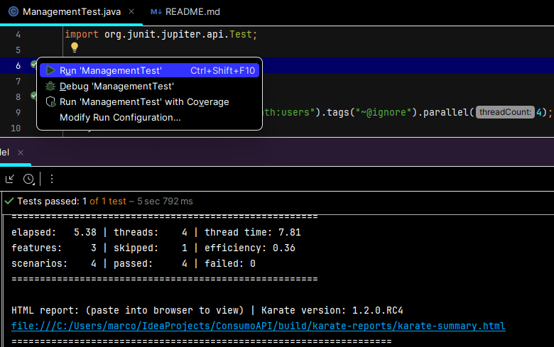
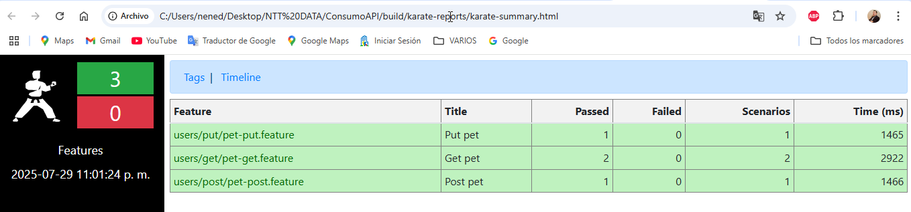

# ¡Consumo API PetStore! 🚀

Las pruebas están centradas en el sitio web https://petstore.swagger.io/ con los siguientes escenarios:

## Pre requisitos para ejecutar 📋
- Java version "19.0.2" 2023-01-17 o superior y JDK (variables de entorno configuradas).
- IntelliJ IDEA
- Gradle version 8.3 (variables de entorno configuradas).

## Ejecutar pruebas 🔨

La automatización está parametrizado para que se realice la ejecuciòn en paralelo, 
por lo cual solo se requiere ejecutar la clase ManagementTest del archivo ManagementTest.java

El reporte del resultado de la ejecución podrá encontrarlo en la siguiente ruta:
/build/karate-reports/karate-summary.html

Resultados Ejecucion

## Navegador Web 🌐
Actualmente la automatización ejecuta por defecto con Chrome.

**Diego Pauta**
